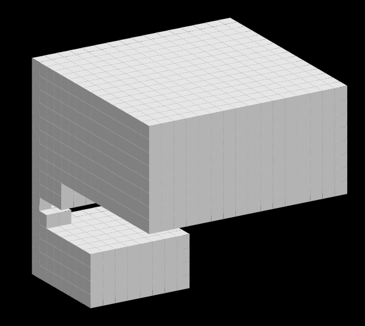

# Basic Syntax

Here we have some _italics_ and **bolding**

## Links and Images

Go back [home](index.md)

An image, rendered in Desmos:


## Block-level

> This is a blockquote

An unordered list

- JavaScript: `Math.sin(2+5)`
- J: `1 o. 2+5`
- Python `math.sin(2+5)`

```
// A code block can have several lines
a =: i.5
echo a
echo 5+a
```

---

An ordered list

1. Desmos
2. Geogebra
3. ...
4. TI 🤮
