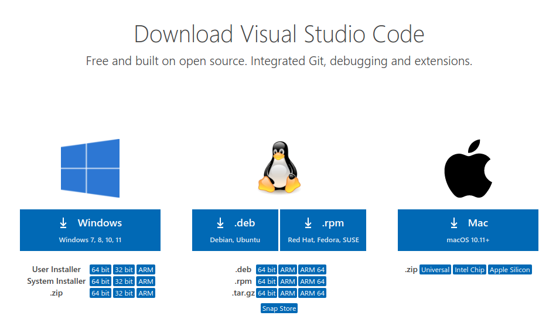
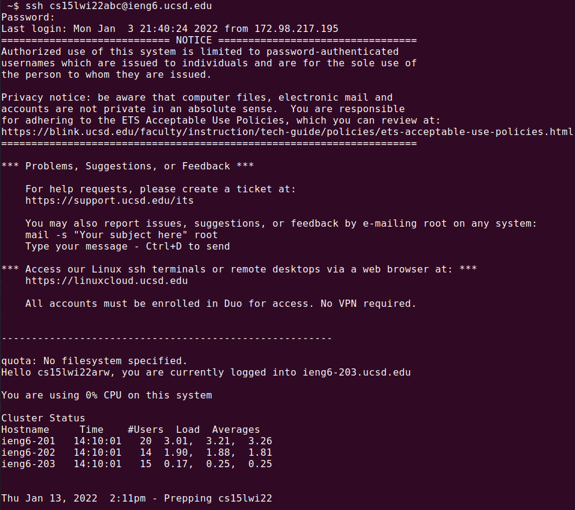
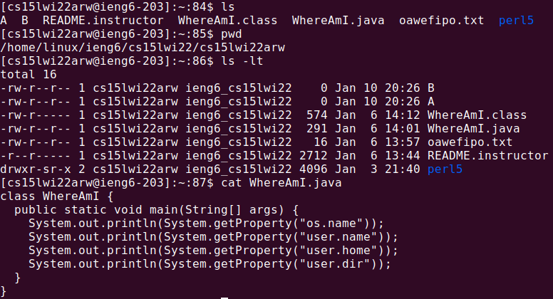
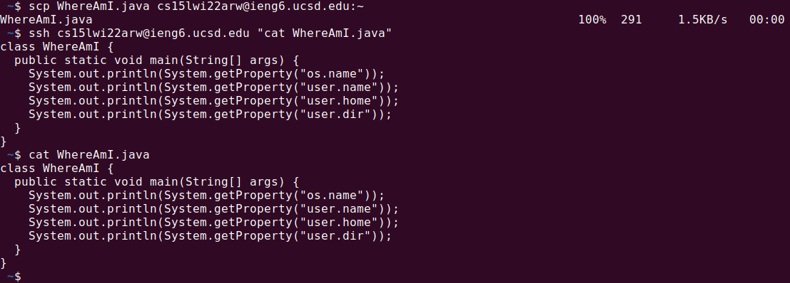
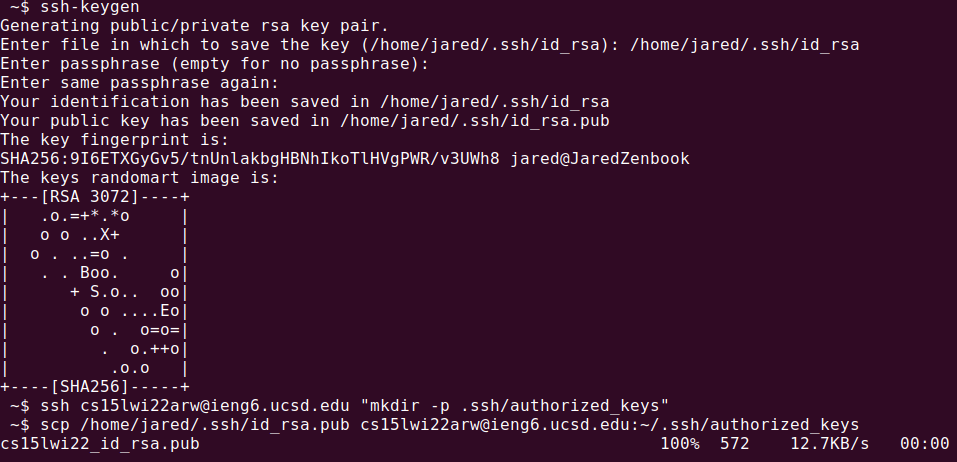

Go back [home](index.md)

## Installing VS Code

Visit https://code.visualstudio.com/download to download VS Code.



## SSH to ieng6

- Visit https://sdacs.ucsd.edu/~icc/index.php or https://sdacs.ucsd.edu/cgi-bin/alloc-query to check the username and change password
- Already have SSH installed, but if on windows, [install OpenSSH](https://docs.microsoft.com/en-us/windows-server/administration/openssh/openssh_install_firstuse)
- Use the following command to ssh in

  ```
  ssh cs15lwi22abc@ieng6.ucsd.edu
  ```



## Run some commands

Try running some commands in the SSH session

- `ls`: list files in the current directory
- `ls -lt`: list files in the current directory, sorted by time, listing all information about them
- `pwd`: Print working directory
- `cat filename`: Print the contents of the file `filename`



## Secure Copy Files

Use `scp source cs15lwi22abc@ieng6.ucsd.edu:dest` to copy from local file `source` to remote `dest`



## Log in Without a Password

Use `ssh-keygen` to create a public and private key, then copy the public key to `.ssh/authorized_keys` on the remote.



## Optimize Remote Running

Two tricks

- Use `ssh cs15lwi22abc@ieng6.ucsd.edu "command"` to run `command` over ssh, then exit
- Use `command1; command2` to run `command1` then `command2`


