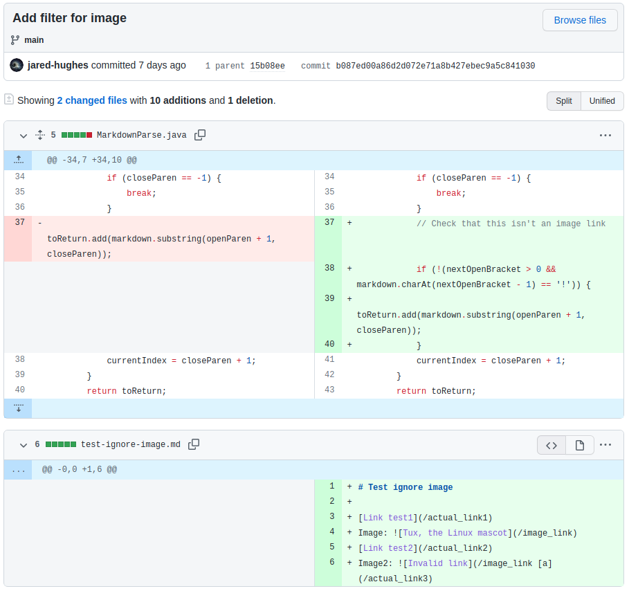
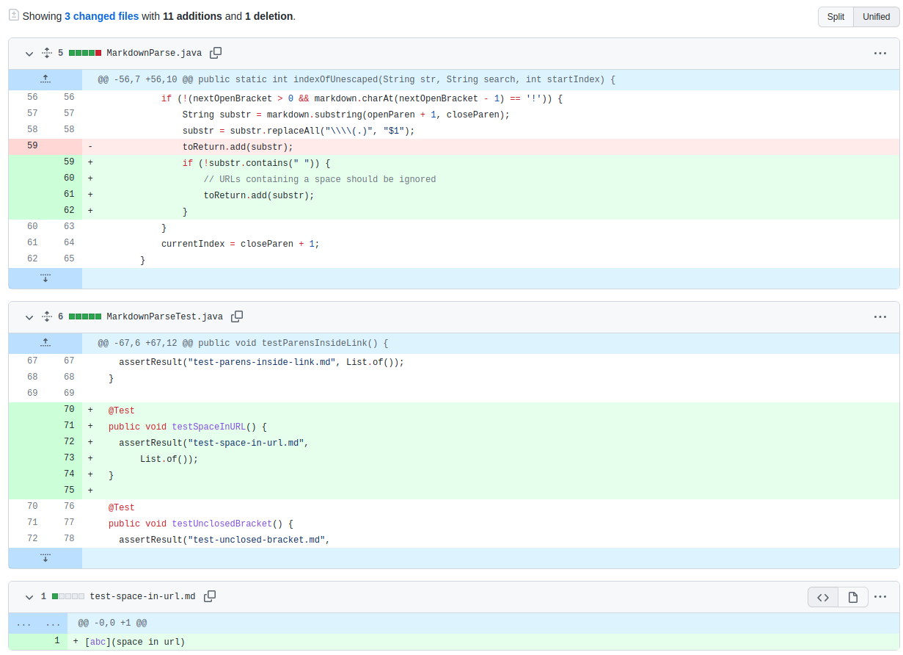
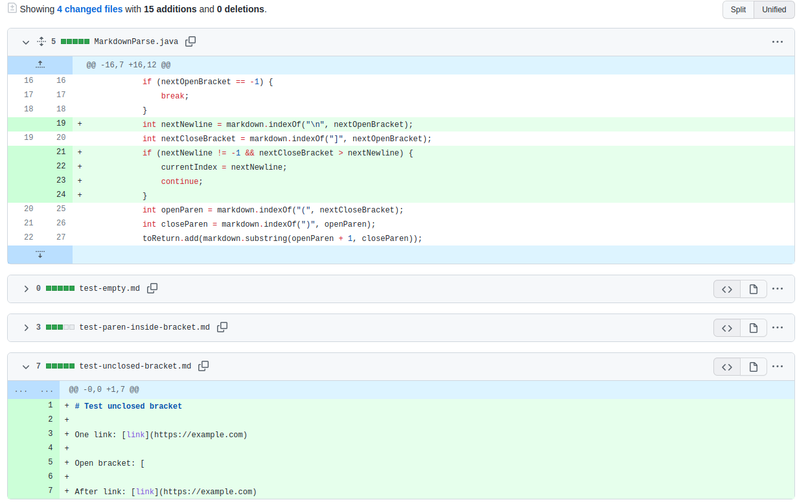

Go back [home](index.md)

# Week 4

## Diff example 1

Diff: <a href="https://github.com/jared-hughes/markdown-parse/commit/b087ed00a86d2d072e71a8b427ebec9a5c841030">

Test file: [test-ignore-image.md](https://github.com/jared-hughes/markdown-parse/blob/main/test-ignore-image.md)

```md
# Test ignore image

[Link test1](/actual_link1)
Image: 
[Link test2](/actual_link2)
Image2: 
```

Fail:

```
 ~/markdown-parse$ java MarkdownParse test-ignore-image.md
[/actual_link1, /image_link, /actual_link2, /actual_link3]
```

Expected:

```
 ~/markdown-parse$ java MarkdownParse test-ignore-image.md
[/actual_link1, /actual_link2, /actual_link3]
```

The bug was the code missed a check before `[` for `!`, which indicates an image.
The failure-inducing input was the contents of `test-ignore-image.md`, and the symptom was including `/image_link` in the link list, when it should not have. The bug caused the symptom when the program was run on the failure-inducing input.

## Diff example 2

Diff: <a href="https://github.com/jared-hughes/markdown-parse/commit/fc35cb4475c6e32b5e95f520a3831c294db41c68"></a>

Test file: [test-space-in-url.md](https://github.com/jared-hughes/markdown-parse/blob/main/test-space-in-url.md)

```md
[abc](space in url)
```

Fail:

```
 ~/markdown-parse$ java MarkdownParse test-space-in-url.md
[space in url]
```

Expected:

```
 ~/markdown-parse$ java MarkdownParse test-space-in-url.md
[]
```

The bug was the code didn't check for a space in the URL. The failure-inducing input was the contexts of `test-space-in-url.md`, and the symptom was including `space in url` in the link list, when it should not have. The bug caused the symptom when the program was run on the failure-inducing input.

## Diff example 3

Diff: <a href="https://github.com/jared-hughes/markdown-parse/commit/273fa0950682dbc793b85b7520a611e179689bf9"></a>

Test file: [test-unclosed-bracket.md](https://github.com/jared-hughes/markdown-parse/blob/main/test-unclosed-bracket.md)

```md
# Test unclosed bracket

One link: [link](https://example.com)

Open bracket: [

After link: [link](https://example.com/2)
```

Fail:

```
 ~/markdown-parse$ java MarkdownParse test-unclosed-bracket.md
[https://example.com]
```

Expected:

```
 ~/markdown-parse$ java MarkdownParse test-unclosed-bracket.md
[https://example.com, https://example.com]
```

The bug was the code ignored newlines, specifically in the link text. The failure-inducing input was the contents of `test-unclosed-bracket.md`, and the symptom was including only one link, instead of two, in the output list of links. The bug caused the symptom when the program was run on the failure-inducing input.
