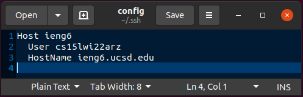
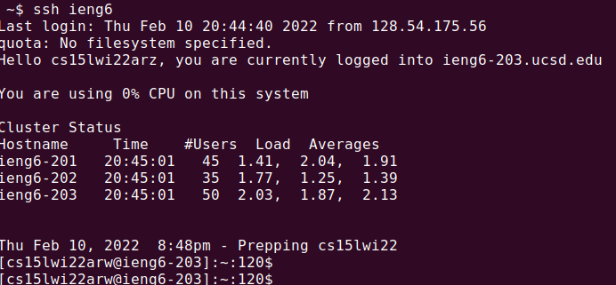
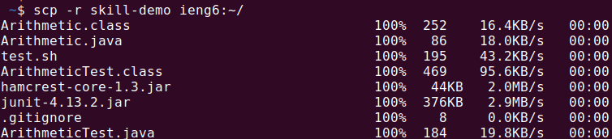

Go back [home](index.md)

# Week 6

Option 1 - Streamlining ssh Configuration

## The `.ssh/config` file

Edited `~/.ssh/config` using gedit. This includes the alias on line 1, username on line 2, and hostname on line 3.

## Using `ssh` with alias

Just use the `ieng6` alias instead of the full username@hostname. It works the same.

## Using `scp` with alias

Again, use the `ieng6` alias instead of the full username@hostname. It performs the same server copy.

